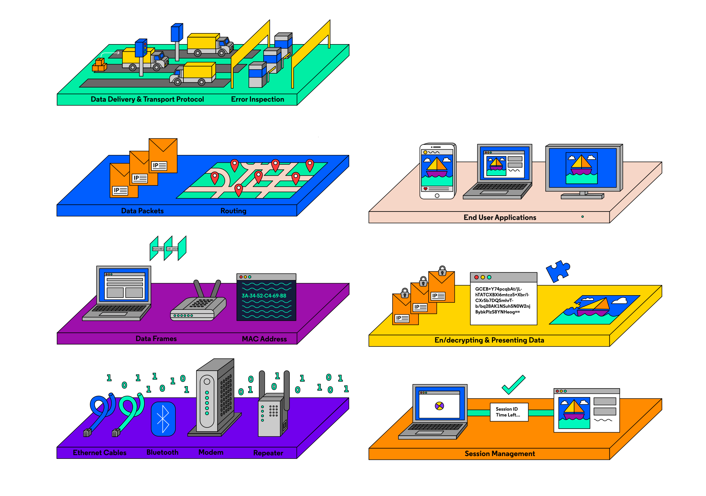
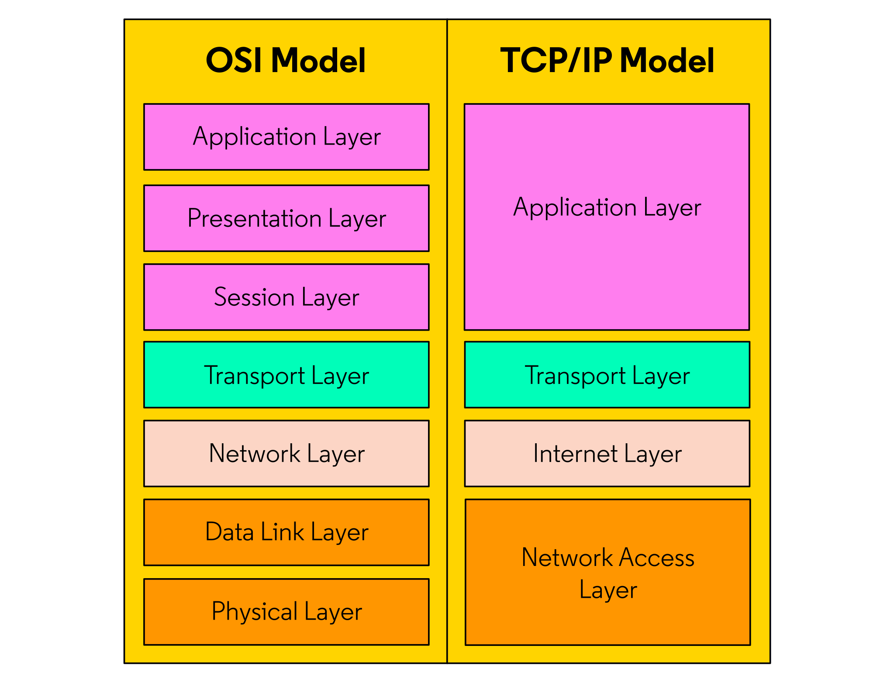

# Introduction to Network Basics
A **network** is two or more computers or devices that are linked in order to share information. our computers and devices are able to communicate due to a large set of standards, much like we have road systems and traffic protocols when we drive a car. These network standards have been built by the community over the decades, and these standards guide engineers and security professionals.

<br>

# Types of Networks
Networks are broken into different subsets based on their size and function. Here are some of the most common network types:

## **LAN**
A Local Area Network (LAN) is a smaller network that connects multiple devices in a limited area. Examples of LANs include small offices, a home, or any other network contained within a small area.


## **CAN**
A Campus Area Network (CAN) connects multiple computers and devices over a slightly larger area. In many cases, these types of networks will connect multiple buildings located in the same vicinity. You may see these networks in a university where multiple buildings and outdoor spaces provide students with network access.


## **WAN**
A Wide Area Network (WAN) connects multiple computers over a geographically large area. Large, international organizations may operate these types of networks. To ensure that computers spread over large regions are able to communicate, companies may use a VPN (Virtual Private Network) to connect systems securely. A VPN can allow systems across large regions to connect and interact with one another on the same network.

<br>

# OSI: Network Model
The OSI (Open Systems Interconnection) Model was developed in the 1970s and 1980s, and it is a conceptual model that breaks networking into seven separate layers. Each layer refers to a set of functions that are responsible for specific tasks. The layers start from physical signals all the way up to the web applications we interact with. 

Each layer generally only interacts with the layer below it and provides useful tools or information to the layer above it.



OSI is used to help us categorize network processes so we can communicate about them during troubleshooting and while improving security.


## **Layer 1 - Physical**
The **Physical**, and lowest layer of the model, covers how unstructured data, like bits, is transmitted. Some concrete examples of this are the ways wires are configured, the way signals are transferred over those wires, and the radio frequencies computers use. Technology such as WiFi, Bluetooth, and cable standards such as CAT5 and CAT6 all operate at this layer. This layer also includes the hardware part of modems, adapters, and repeaters.

<br>

## **Layer 2 - Data Link**
The **Data Link** layer covers how data is sent from device to device when they are connected on the same local network.

The data link layer includes many functionalities:
- It structures incoming or outgoing data bits into data frames.
- It involves physical addresses of devices, called Media Access Control (MAC) address. All devices have a unique 48-bit MAC address where the first 24 bits relate to the manufacturer, and the last 24 bits make it unique to each device.
- It routes data frames to the correct physical addresses. A switch (could be your computer or router) keeps track of local devices and their MAC addresses and makes sure data frames get to the correct physical location.
- It ensures the flow of data is synchronized between devices, so data doesn’t jam up the memory of a slow receiving physical device.
- It detects errors within data frames. This involves a system of error control!

<br>

## **Layer 3 - Network**
The **Network** layer describes how data packets are routed between wider networks such as the Internet. Whereas a data frame at the data link layer travels to local MAC addresses, a data packet at the network layer is routed from a source IP (Internet Protocol) address to a destination IP address.


Think of a data packet as an envelope. IP addresses are assigned to every computer or device connected to the Internet, and these addresses are formatted into four numbers each ranging from 0 to 255. Example:

```
192.168.0.1
```

At this layer, there are routing protocols designed to help packets (aka, our envelopes) get from point A to point B as quickly as possible over the Internet. Your nearest router is one of the many routers connected to the Internet that help packets find where they need to go!


<br>

## **Layer 4 - Transport**
The **Transport** layer refers to how data is actually transferred. Let’s say you wanted to upload a photo from your phone onto social media. The transport layer handles how the image data from that photo is split (segmentation), the rate at which the packets are sent, and how errors are handled if data packets don’t make it to the site’s server.

The most common transport protocols on the Internet are TCP (Transmission Control Protocol) and UDP (User Datagram Protocol). We’ll go into these two protocols later in this lesson!

<br>

## **Layer 5 - Session**
When two computers or devices have started an exchange of information, we call that a session. The Session layer in OSI is responsible for opening, closing, and maintaining sessions.

In terms of opening and closing, the session layer includes authentication and authorization measures. For example, without logging in or having the right permissions, you may not be able to connect to parts of a website. But if you are logged in, your access permission is stored for a set amount of time, or session length.

Meanwhile, session management ensures communications occur successfully by providing safeguards in case a connection fails or drops.

<br>

## **Layer 6 - Presentation**
The **Presentation** layer includes all the methods that convert data into a format usable by an application. This layer handles functions such as encoding/decoding, encryption/decryption, and compression/decompression of files.

<br>

## **Layer 7 - Application**
The final layer of the OSI model is the Application layer. This layer includes websites, browsers, email, mobile applications, and how they render Internet data so that we can interact with it.

<br>

#  TCP/IP Model
The OSI Model isn't the only model that describes networking. You will hear more often about the TCP/IP model which is a 4-layered model that makes direct reference to current internet implementations 

## **Application Layer**
This is the opening and closing of sessions, translating data, and the interaction with content at the application level. Here, there are multiple protocols for web content, emails, and accessing files, including HTTP, FTP, SMTP, etc.

## **Transport Layer**
TCP and UDP are the core protocols here. **TCP** is a connection-oritented protocol, where a more rigorous acknowledgement between one sender and one receiver must happen before any data can be sent. This protocol also includes flow control and error recovery, and it is used when larger amounts off data need to be sent and timing is less of a concern.

## **Internet Layer**
This is where the IP addressing and routing occur

## **Network Access Layer**
Sometimes called the Link layer, this layer encompasses the sending or receiving of network data at the local network level.

<br>



<br>

# Network Protocols: DNS, HTTP, Email
What are network protocols? They are simply a set of standards for devices interacting on the Internet! It’s important to understand these protocols from the angle of network security. Threat actors often abuse the rules of a protocol to gain access to sensitive information.

<br>

## **DNS**
the **Domain Name System (DNS)** protocol converts domain names to IP addresses. Think of it as a phonebookfor the internet It's hard to remember an exact IP address when we want to access a website. When we request the URL `codecademy.com`, our computer sends a DNS request to a DNS server. Then the server will return the correct IP addresses to route data to and from Codecademy.

<br>

## **HTTP**
The **HTTP (The Hyper Text Transfer Protocol)** handles our web requests to servers. HTTP uses a set oof verbs, like `GET`, `POST`, `PUT`, and `HEAD`, to retrieve and send data.

<br>

## **IMAP, POP, and SMTP**
How does email work? **IMAP (Internet Message Access Protocol)** and **POP (Post Offic Protocol)** allow users to access emails stored on a remote web server. In IMAP, servers store your email and return copies to you, allowing you to access the same email on multiple devices. 

In **POP3 (POP version 3)**, however, emails are generally downloaded from the server onto just a single device. To send email, the standard is **SMTP (Simple Mail Transfer Protocol)**.

<br>

## **SSH**
**Secure Shell (SSH)** is used to access a remote terminal or virtual machine (VM) over a secure connection. IT professionals and engineers use this to help configure and program a system remotely and securely. For example, accessing Github from the command line uses SSH!

<br>

## **FTP**
The **File Transfer Protocol (FTP)** is used to transfer files from one system to another. Modern implementations of FTP can include encryption as well.

<br>

## **SMB**
The **Server Message Block (SMB)** protocol allows multiple users to interact with a remote system like a file share or printing services. Multiple people can view and modify shared resources and files in a centralised server. 