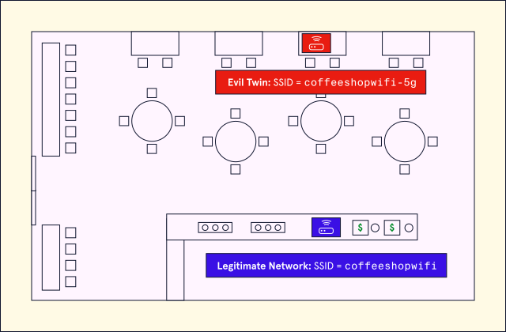

# Wireless Attacks
We learn about the attacks targeting or involving wireless communication technologies such as Wi-Fi, Bluetooth, RFID chips, and more. We'll look at thow attackers can exploit and distrupt these technolgoies for their own gain.

 

## **Wi-Fi Attacks**
Wi-Fi is essentially a wirless analog to an ethernet cable, its primary use is to connect endpoints such as computers or tablets, to a router via a wireless access point. Most routers used in the home are wireless routers, which function as both router and wireless access point. 

 

## **Evil Twin Attacks**
An **Evil Twin attack** is where an attacker will create a malicious Wi-Fi network that looks legitimate. For example, an attacker might go to a coffee shop that provides free Wi-Fi, then set up their wireless access point with a very similar name to the coffee shop's network.

Any unencrypted traffic passing the attacker's access point can be intercepted by the attacker, making it very useful for Man-in-the-Middle attacks. It's also possible to create a network that has the exact same name as legitimate netowkr, and devices will usually try to connect to the stronger access point. 

 

## **Rougue Access Points**
A **Rouge Access Point** is a deivce connected to a network that has not been approved by the network's administrator. 

This can be any device, from an employee's personal phone to a malicious backdoor installed by an attacker who gained physical access to an ethernet port on the network.

 

## **Wi-Fi DOS Attacks**
A **Wi-Fi disassociation attack** is when an attacker breaks the connection between a victim and a wireless access point.  This type of attack involves an attacker posing as the victim, and sending a message to the wireless access point telling it to disassociate from the victum. This is a type of denial of service (DOS) attack.

Wi-Fi uses radio waves to communicate wirelessly, and these radio waves are susceptible to electromagnetic interference. **Jamming** is when an attacker purposefully uses this interference to interfere with the victims' connections. Such attacks can completely block communication over a channel. 

 

# Attacks involving short-range communication

## **Bluesnarfing and Bluejacking**
Bluetooth is a teachnology used for short-range wirless communication. It is commonly used by wireless peripherals such as headphones or computer mice to connect to smartphones and computers. 

Bluetooth devices need to be able to find each other in order to work, but this can be exploited by attackers in a teachnique known as bluesnarfing.

**Bluesnarfing** involves looking for bluetooth devices operating in discovery mode, and attempting to exploit vulnerabilities in OBEX (the protocol for exchanging data between wirless devices, to steal data from the targeted device).

 

## **RFID**
**Radio-Frequency Identification (RFID)** uses radio waves to transmit information from a tag that store the information, to a reader that retrieves information from a tag. 

 

## **NFC**
**Near-Field Communication (NFC)** is similar to RFID in that it is a very short-range method of wireless communication, limited to only a few centimeters. Unlike RFID, NFC can work bidirectionally: A phone, for example, can send or receive data rather than being limited to one or the other.

Both NFC and RFID technology are vulnerable to skimming, where an attacker illicitly accesses the information stored in an RFID tag or transmitted via NFC. Electromagnetic interference can also interfere with RFID and NFC.

 

# Conclusion
Wireless communication technologies are convenient and useful, but also introduce new attack vectors into our communications. Eavesdropping and data theft can be made much easier with wireless communications, and many protocols weren’t necessarily designed with security in mind, meaning we need to take extra precautions when using them.
