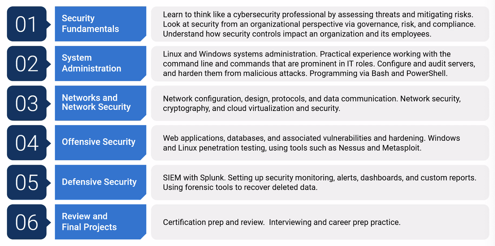

# Curriculum

## Four Projects

- **Project 1:** Securing Cloud Apps-in the first project week, you will buiild, secure, and protect a cloud application.
- **Project 2:** Offensive Security CTF-A three-day CTF in which you will use the kills that you have learned in the Offensive Security module to attack a fictional organisation and determine their vulnerabilities
- **Project 3:** Building a Monitoring Solution-You will design a custom monitoring solution for afictional organisation, monitoring the environment during a series of simulated attacks
- **Project 4:** bootCon-In the final project, you will present independently researched projects that demonstrate one of the following:
  - Exploiting a vulnerability of an IoT device
  - Developing code or a program that can complete a cybersecurity task
  - Demonstration of how a cybersecurity tool that was not covered in class can accomplished a speicifc goal.
