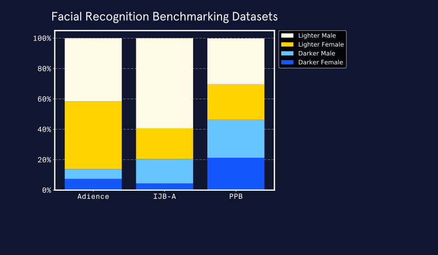

# Bias in Data Analysis

As humans, we have many biases, both implicit and explicit. Biases are systematic errors in thinking influenced by cultural and personal experiences. Biases distort our perception and cause us to make incorect decisions. One bias that many humans share is automation bias. Automation bias stems from the idea that computers or machines are more trustworthy than humans because they are more objective. Automation bias is at the root of why people follow their GPS into trouble, even when contradictory information is available.

Computers, data, and algorithms are not actually completely objective. It is true that data analysis can help us make better decisions, but it is not immune to bias. Humans create technologies and algorithms. As a result, they often have human biases encoded into them. It's clear that we need to pay attention to other information streams when we drive with GPS. Similarly, we need to look at more information sources when we evaluate data analysis results or reports.

If we want to be responsible when we use data and algorithms, we need to understand the different types of bias that show up at each stage of analyzing data. Let’s take a closer look at some types of bias that impact data analysis and data-driven decision-making.

## Bias in data collection

Before we can analyse data or use machine learning algorithms, we need to collect data. Data collection is subject to **selection bias** (also called sample bias). Selection bias occurs when study subjects are not representative of the population. Selection bias can be due to poor study design if the sample is too small or is not randomised. Selection bias can also crop up when the only data available is influenced by **historical bias** -- systematic influence based on historic social and cultural beliefs.

We can do our best to avoid selection bias by doing everything possible to have a representative sample, not just a convenient one. For example, it’s a good idea to include data inputs from multiple sources to diversify data. This is easier said than done, however, and we need to acknowledge and address historical bias in data sources and work towards building frameworks to increase inclusivity.

## Bias in building and optimsing algorithms

**Algorithmic bias** arises when an algorithm produces systematic and repeatable errors that lead to unfair outcomes, such as privileging on group over another. Algorithmic bias can be initiated through selection bias and then reinforced and perpetuated by other bias types. 

Facial recognition software is an area where algorithmic bias can do a lot of harm. This software is sold to police departments and used to recognise criminals in surveillance footage. If the software systematically makes more mistakes depending on race or gender, people in some groups will be incorrectly pursued more often, which has serious, negative outcomes for individuals.

[The Gender Shades project](http://gendershades.org/index.html) tested commercial facial recognition software for these kinds of biases. IBM, Microsoft, and Face++ are three companies that offer facial recognition software with a binary gender classifier feature. Researchers assessed the accuracy of these algorithms and discovered that they suffered from algorithmic bias. The algorithms were good at identifying lighter males, okay at identifying darker males and lighter females, and very bad at identifying darker females.

Each software used proprietary algorithms and did not report performance results with benchmarking datasets. However, the developers probably tested the software on one of two commonly-used benchmarking datasets: Adience or IJB-A. These datasets include few dark-skinned people and especially low proportions of dark-skinned females. Testing an algorithm with a non-representative dataset leads to  **evaluation bias**. Testing with a non-representative benchmarking dataset would give high overall accuracy scores, even if the algorithms were inaccurate for certain groups.

Another key point when it comes to algorithmic bias in facial recognition software is that the algorithms are proprietary, making them “black boxes”. In addition to not knowing what data were used to train and test the algorithm, we can’t know how it was designed or how it works. As a result, it’s impossible to evaluate the algorithms themselves.

Avoiding algorithmic bias relies on transparency, especially concerning data used for training and testing an algorithm. In response to the poor performance of facial recognition with darker females, a new benchmarking dataset was developed (PPB) that is more representative of the full spectrum of humanity. This is a big step forward, as long as the new dataset is actually used by companies making and selling facial recognition software.

## Bias in interpreting results and drawing conclusions

Bias also influences the final stages of data analysis: interpreting results and drawing conclusions. The following bias types are ones we should watch out for when evaluating or generating data reports:

- **Confirmation bias** is our tendency to seek out information that supports our views. Confirmation bias influences data analysis when we consciously or unconsciously interpret results in a way that supports our original hypothesis  To limit confirmation bias, clearly state hypotheses and goals before starting an analysis, and then honestyl evaluate how they influenced our interpretation and reporting of restuls.

* **Overgeneralisation bias** is inappropriately extending observations made with one dataset to other datasets, leading to overinterpreting results and unjustified extrapolation. To limit overgeneralization bias, be thoughtful when interpreting data, only extend results beyond the dataset used to generate them when it is justified, and only extend results to the proper population.
* **Reporting bias** is the human tendency to only report or share results that affirm our beliefs or hypotheses, also known as “positive” results. Editors, publishers, and readers are also subject to reporting bias as positive results are published, read, and cited more often. To limit reporting bias, report negative results and cite others who do, too.

# Conclusions

Data and machine learning algorithms are now ubiquitous. They influence decisions about who is hired or fired, accepted into schools, or allowed to rent houses. They even influence which neighborhoods are more heavily policed and who is granted parole. Therefore, we must recognize that data and algorithms can be biased, just like the humans who create and train them. Learning more about the types of bias that influence how algorithms function will improve our ability to perform and interpret data analyses and will help us make more informed decisions.
