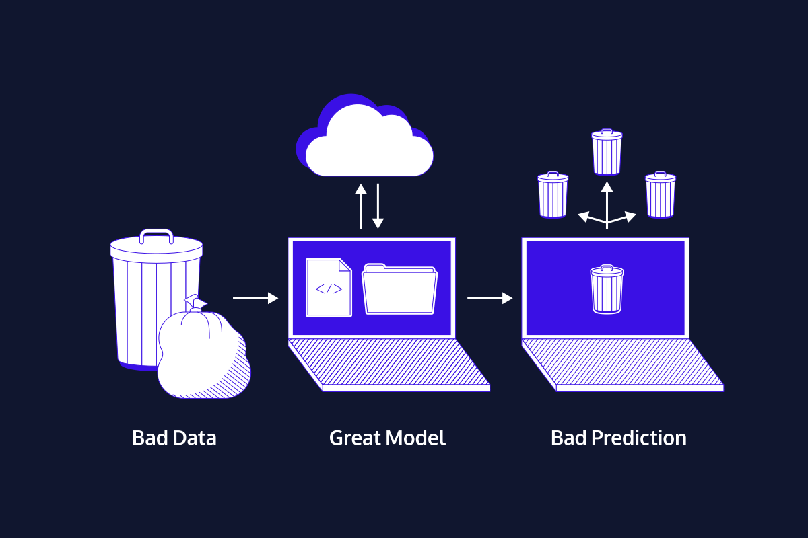

# Data Literacy
Organisations go through so much data. Data scientists and analysts are at the forefront of working with it. But they do not work alone, and even the most technically sophisticated data scientist will need to communicate about data. 

### What will Data Literacy cover?
1. Case studies about what can go wrong – and right in data projects.
2. Basic assumptions of working with different types of data.
3. How data types affect the analysis.
4. Foundational statistical ideas.
5. Key ideas behind good (and misleading) visualizations. 
  

#### Through this time we will be able to
- Spot messy data and make a plan to clean it.
- Critically evaluate whether a statistical technique is a good idea.
- Apply appropriate data manipulation methods.
- Spot the difference between good and bad visualizations.
- Make a plan for how to transform a bad visualization into a good one.
- Reference classic case studies involving perfect and poor data analysis.

## Data Gaps
***Garbage in, garbage out*** is a phrase about data where our data drive conclusions are only as strong, robust, and well-supported as the data behind them. 

Part of understanding and communicating with data means asking the right questions so that we end up with useful, and relevant data. Some of those questions can be like,
- Does the data sufficiently answer the question at hand?
- Can my data answer that question exactly?

## Addressing Bias
Part of practicing good data literacy means asking questions like,

1. Who participated in the data?
2. Who is left out?
3. Who made the data?

## What is Statistics?
Statistics helps us test the likelihood of an event happening by random chance versus systematically.
   

## Causal Analysis
***Correlation does not equal causation*** is a common term in the data world. In other words, what it means is that there are two events might be connected or related, but that doesn't mean they're in a cause-and-effect relationship.

A ***causal link*** means proving that one event causes another. 
  
**Case Study:  John Snow's Cholera Theory** 
Let’s take a look at one of the earliest instances of successful causal analysis in medicine, which starts with a man called John Snow. (Not the fantasy-famous Lord of the North, but a real-life nineteenth century London doctor.)

Until Dr. Snow’s discovery in the mid-nineteenth century, people believed that cholera was caused by vapors rising from the burial grounds of plague victims from two centuries earlier. (A good try, but cholera is actually a waterborne disease caused by bacteria found in sewage. It causes severe dehydration and has a fatality rate of over 50% when untreated.)

By studying earlier cholera epidemics and organizing his data analysis around his hunch that cholera was waterborne, Dr. Snow was able to link an 1854 cholera outbreak in London to a contaminated water pump – effectively proving a causal relationship between contaminated water and cholera before humans even knew that bacteria existed!