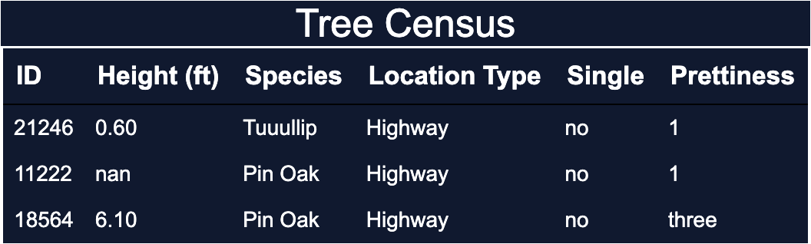
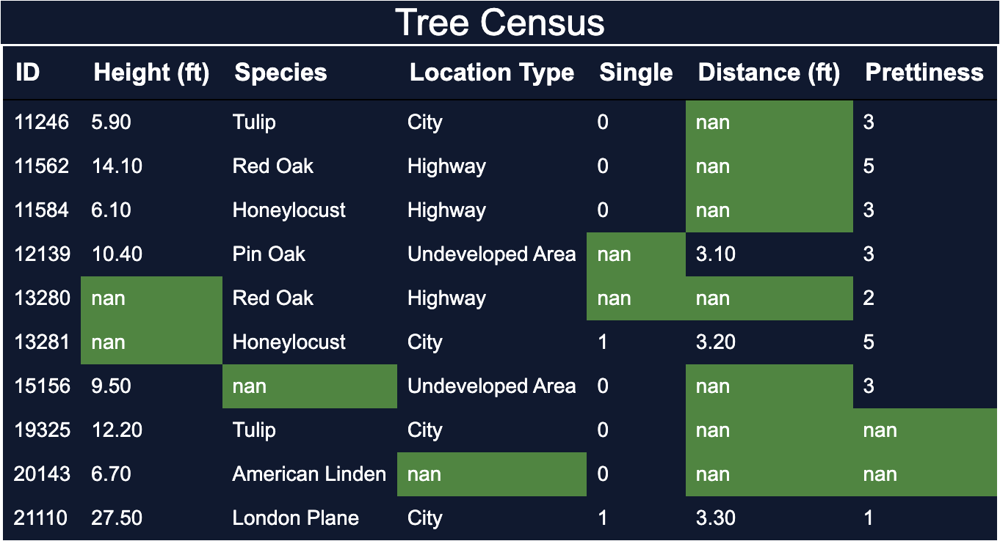

# Data Types and Quality

## Introduction to Data Types and Quality

Data can mean a lot of things, but within data science, it typically means a collection of organised obersvations.
There are two types of organisation: **methodology** and **shape**.

The **methodology** is how the data was collection, and the **shape** for data is a spreadsheet or table.

 

## The Shape of Data

If we make an example, of ourselves becoming tree census takers, you’ll start with height and species. ‘Height’ and ‘Species’ are our variables. The height of each tree can “vary” from one tree to another (hence the name).

Each individual tree is called an entity, observation, or instance (there are a lot of names for this). We’ll stick with observations, but know that these three terms are used interchangeably.

In a well-organized dataset, the variables describe a characteristic of our entities. However, it can be surprisingly difficult to define good variables. Good variables measure only one characteristic and should not be a characteristic themselves. Let’s look at an example.

For example, in our tree dataset, we are interested in the type of environment the tree is in. For example, we are looking at trees along city streets, highways, and in undeveloped areas. We also want to know if trees are standing alone or with others.

``

There are many ways to organize this. We could:

Make 3 new variables: ‘City’, ‘Highway’, ‘Undeveloped’ and input ‘alone’ or ‘group’ in the values.
Make 2 new variables: ‘Location’ and ‘Single’ and input the location type in the ‘Location’ variable and 0 or 1 in the ‘Single’ variable.

 

## Variable Types

In our tree census, we are collecting data about two types of variables: one that we measure (height) and one that we categorize (species).

The difference between measuring and categorizing is so important that the data itself is termed differently:

- Variables that are measured are **Numerical** variables
- Variables that are categorized are **Categorical** variables.

 

## Dealing with messy data

*All happy datasets are alike; each unhappy dataset is unhappy in its own way.*
What this is saying is that clean datasets are alike, but every messy dataset is messy in its own unique way. That's why cleaning data involves a lot of critically considering the nuances of the dataset you are worrking with.
`  `

**What is a Messy Dataset?** ` `
Messy Data has many problems that they need to be handled differenly, for each one. For example,

1. **Typos**, for example Tuuulip for Tulip
2. **Missing data** is like the containing nulls and missing information for fields
3. **Inconsistent coding**, is like when a value is true representing some value, but in other applications true can have different meanings.

 

Finding and solving these problems requires a lot of detective work. And for now, we need to fix these issues manually, but know that if you work with data, you will see these issues again.

 

## Working with Missing Data

There are different reasons for missing data.

1. When there is missing data with no systematic or deeper reason. This kind of missing is ***Missing Completely at Random***.
2. There is also values that can be preditected. Such that if one value is missing, then based on another variable it can be protected. This is ***Missing at Random***.
3. Finally, data can be structurally missing, meaning that we wouldn't expect a value there to begin with. If there is no data, then it will be ***structurally missing***.

 

## Accuracy

When it comes the accuracy of a dataset,

1. Thinking about the data against expectations and common sense is crucial for spotting issues with accuracy. You can do this by inspecting the distribution and outliers to get clues about what the data looks like
2. Critically considering how errors could have crept in during the data collection process will help you group and evaluatethe data to uncover systematic inconsistencies.
3. Identify ways that duplicate values could have been created goes a long way towards ensuring that reality is only represented once in your data. A useful techniqueis to distinguish between what was human collectedversus programmatically generated and using that distinction to segment the data

 

## Validity

It's not just typos, mistakes, missing data, poor measurement, and duplicated observations that make a dataset low quality. We also have to make sure that our data actually measures what we think it is measuring. This is the ***validity*** of our dataset.
