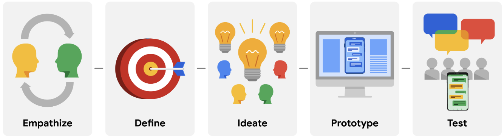

# Design Thinking: UX Design Framework

**Design Thinking** framework to sequence the assignments that contribute to the designs that you’ll create throughout the program. The Design Thinking framework is a user-centered approach to problem-solving that includes activities like research, prototyping, and testing to help you understand who your user is, what their problems are, and what your design should include.

The Design Thinking framework involves the following phases: empathize, define, ideate, prototype, and test.

## Empathise

During the **empathize** phase, your primary goal is to learn more about the user and their problems, wants, and needs, and the environment or context in which they’ll experience your design. The most important part of the empathize phase is to step away from your assumptions and guesses and let your research findings inform your decision-making in later design phases.

Your user research might include user surveys, interviews, and observation sessions, and you might also need to conduct some research on the competitors’ products to determine how your user frames competitors’ products as part of their daily life and daily problem-solving.

## Define

In the **define** phase, you’ll analyze your research findings from the empathize phase and determine which user problems are the most important ones to solve, and why. This will drive you toward a clear goal for the design of the product.

The most important outcome of this phase is a clear problem statement, which is a description of the user’s need that your designs will address. You might also develop a value proposition, which is a summary of why your user would or should use the product or service that you’re designing.

## Ideate

After you land on a user problem and establish why it’s an important one to solve, it’s time for the **ideate** phase. The goal of ideation is to come up with as many design solutions as possible—don’t settle for your first solution because the most obvious solution is not always the right one.

Ideation involves collaborative brainstorming with other members of your team to generate as many solutions as possible to a problem. This could include marketing, engineering, product management, or any other stakeholders for the product or service. During brainstorming sessions, you should explore all possible solutions. Don’t focus on whether something is a “good” or “bad” idea, just collect as many ideas as you can. The important thing here is to keep this process judgment-free.

After brainstorming, you’ll then analyze your potential solutions and start to make choices about which ones are the best options to pursue as prototypes. You might return to user or competitive research to help you narrow down your ideas, and you might also create user flows to illustrate how the user will interact with your solution.

## Prototype and Test

After you have an idea of how to solve the problem, you’re ready to enter the **prototype** phase, where your goal is to produce an early model of a product that demonstrates its functionality and can be used for testing. The **test **phase is critical to developing the right solution to address your user’s problem, and an organized approach to testing can help you create exceptional user experiences.

Prototyping and testing are  interconnected, which means that you’ll  test your designs at each stage of prototype development rather than waiting to test until after the working prototype is complete. If the design is too polished the first time you present it to users, you might not get as much feedback. Think about ways to include testing throughout the design process, so that you’re iterating your designs based on user feedback instead of other reasons.

For example, you might test the concepts behind your design by presenting users with a simple sketch, wireframe, or a sitemap. Taking what you learned, you might iterate on that design to a more detailed design on paper (known as a low-fidelity prototype) and conduct another round of user testing.  At some point, you’ll iterate the design again into a working, interactive model using a software program (also known as a high-fidelity prototype) and test that as well. You might also consider testing more than one prototype at the same time to get feedback on multiple solutions, or testing the same prototype on multiple platforms, such as a laptop, tablet, and smartphone.

The goal of testing prototypes is to  continue to refine the prototype as you gain insight into whether the design for your product or service is easy to use and solves the user’s problem. At some point, you’ll finalize a prototype, and then you’ll provide it to developers, who will then turn your design into a product.
