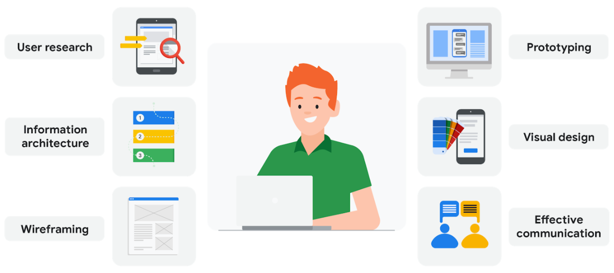

# Job responsibilities of Entry-Level UX Designers

- **User research**: User research is about understanding the people who use your product. Through research, you’ll learn about users’ backgrounds, demographics, motivations, pain points, emotions, and goals. Your research methods might include surveys, observations, and interviews. We’ll explore user research in much more detail in an upcoming course.
- **Researching:** Unstand audiences and learn about their backgrounds, demographics, motivations, pain points, emotions, and life goals
- **Wireframing:** An outline or a sketch of a product or screen
- **Prototyping:** An early model of a product that demonstrates functionality
- **Visual design:** Visual design focuses on how the product or technology looks. As a UX designer, you need to understand the foundations of visual design in order to communicate the connection between a product’s functionality and its appearance to users. You’ll learn some of the most important principles of visual design throughout this certificate program.
- **Creating information architecture:** The framework of a website or how it's organised, categorised, and structured
- ****Effective communication**:** Effective communication as a UX designer means connecting with your colleagues through emails, meetings, presentations, and design software. UX design is a very collaborative field, so being able to communicate both digitally and face-to-face with teammates is important. You need to be a good listener, be receptive to feedback, and share your ideas in a clear way.
