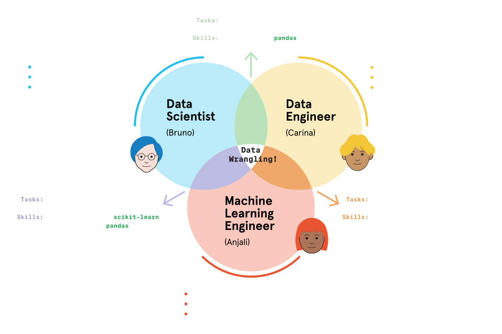

# MLE, Data Scientist, Data Engineer

There are the different roles within Machine Learning, between a Machine Learning Engineer (MLE), Data Scientist (DS) and Data Engineer (DE). The boundaries between these fields are fuzzy and depening on the company, the expectations of these roles can vary a lot.

However, on average, there are a pretty well-defined set of kills and tasks that define these roles. Often knowing the skills of one is immensely useful in another role and transitions from one to another are not uncommon.

We're going to distinguish betwen these three roles

As shown above, there are the primary tasks that each will perform, and the skills where they overlap between the roles.
