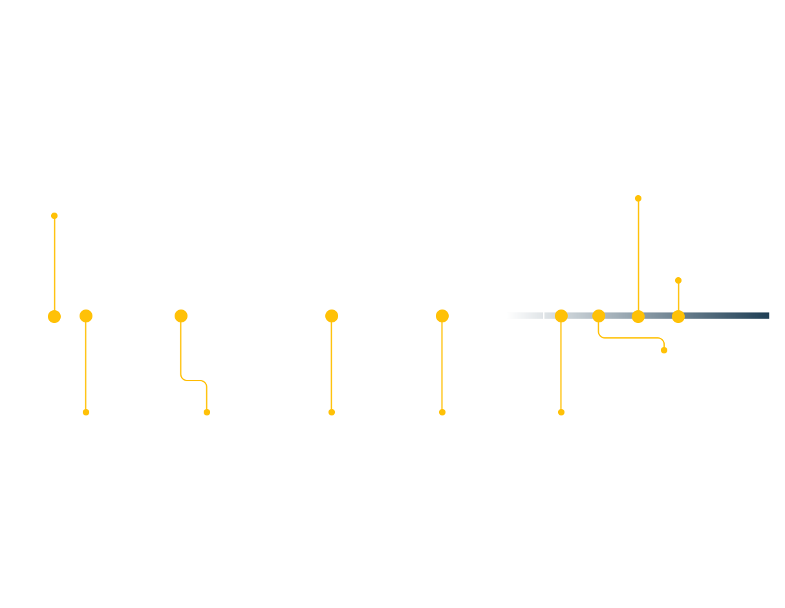

# What is Machine Learning?

Machine learning is an umbrella term for a set of algorithms that analyze and find patterns from known historical information ('training data') to make predictions on unknown/new information. What goes into these algorithms?

- **Mathematics:** Mathematical functions form the basis of modeling process. Specifically, the fields of Probability, Linear Algebra and Calculus are crucial to building mathematical systems capable of modeling real-world data
- **Computer Science:** Programming langauges implement these mathematical models by translating them into a series of executable tasks that a computing machine can implement.
- **Statistics:** Statistical inference and evaluation techniques are at the heart of making sure the model reflects the data as much as possible. They help us answer: How do we know our model works?

The parameters in the mathematical models (mathematics) are 'learned' by implementing them using programing (computer science and upon evaluating their performance (statistics), they're altered if unsatisfactory-and implemented and evaluated again to see if they perform better and so on and so forth.

The machine learning process is thus not a one-and-done process. Rather, it's iterative. Not unlike the way we humans learn. This capacity of machine learning to simulate human cognition makes it a subfield of Artificial Intelligence (AI)

