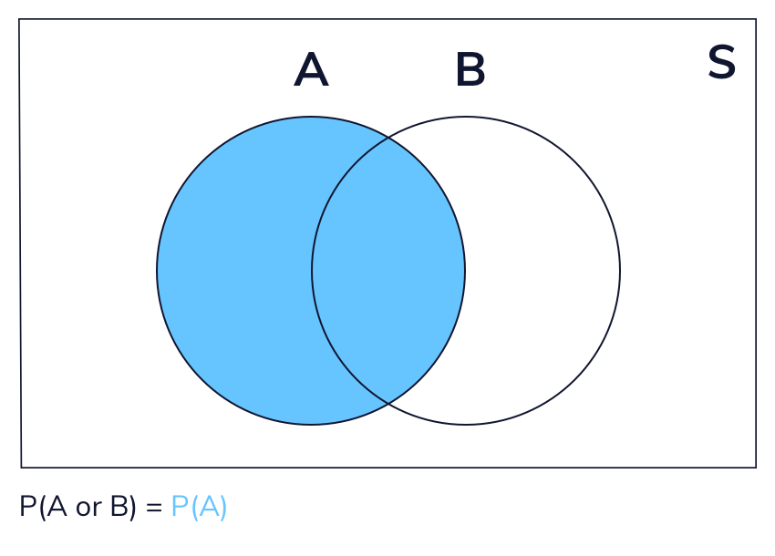

# Probability

Probability is a branch of mathematics that allows us to quanitfy uncertainity. In our dailt lives, we often use probability to make decisions, even without thinking about it.

For example, many weather reports give a percent chance that it will rain. If we hear that there is an 80 percent chance of rain, we probably are not going to make many plans outside. However, if there is only a 5 percent chance of rain, we may feel comfortable planning a picnic.

Probability is way to quantify uncertainty. When we flip a fair coin, we say that there is a 50 persecent change (probability 0.5) of it coming up tails. his means that if we flip Infinitely many fair coins, half of them will come up tails. Similarly, when we roll a six-sided die, we say there is a 1 in 6 chance of rolling a five.

<br>

## **Independence and Dependence**

Imagine that we flip a fair coin 5 times and get 5 heads in a row. Does this affect the probability of getting heads on the next flip? Even though we may feel like it’s time to see “tails”, it is impossible for a past coin flip to impact a future one. The fact that previous coin flips do not affect future ones is called **independence**. Two events are independent if the occurrence of one event does not affect the probability of the other.

Are there cases where previous events DO affect the outcome of the next event? Suppose we have a bag of five marbles: two marbles are blue and three marbles are red.

<br>

## **Mutually Eclusive Events**

Two events are considered **mutually exclusive** if they cannot occur at the same time. For example, consider a single coin flip: the events “tails” and “heads” are mutually exclusive because we cannot get both tails and heads on a single flip.

What about events that are not **mutually exclusive**? If event A is rolling an odd number and event B is rolling a number greater than two, these events are not mutually exclusive. They have an intersection of {3, 5}. Any events that have a non-empty intersection are not mutually exclusive.

<br>

## **Addition Rule**

it’s time to apply these concepts to calculate probabilities.

Let’s go back to one of our first examples: event A is rolling an odd number on a six-sided die and event B is rolling a number greater than two. What if we want to find the probability of one or both events occurring? This is the probability of the union of A and B:

*P(A or B)*



This animation gives a visual representation of the addition rule formula, which is:

*P(A or B) = P(A)+P(B)−P(A and B)*

<br>

## **Conditional Probability**

If we want to calculate the probability taht a pair of dependent events both occur, we need to define conditional probability. 

If we pick two marbles from a bag of five marbles without replacement, the probability that the second marble is red depends on the color of the first marble. We have a special name for this:  *conditional probability* . In short, conditional probability measures the probability of one event occurring, given that another one has already occurred.

Notationally, we denote the word “given” with a vertical line. For example, if we want to represent the probability that we choose a red marble given the first marble is blue, we can write:

P (Red se)

```tex
P(Red Second∣Blue First)
```

```tex

```
