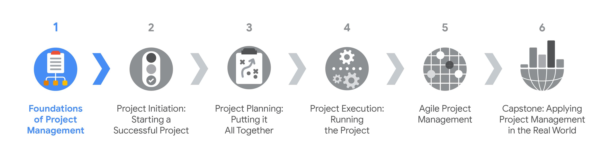

# Project Management

## Introducation

Definition: *The application of knowledge, skills, tools and teachniques to meet the project requirements and achieve the desired outcomes.*

The project management information will contain six industry-relevant courses that focus on

- topics like project management fundamentals
- goals, objectives, and deliverables
- risk management
- team dynamics
- project management methodologies, and
- data-driven decision making

## Outline

