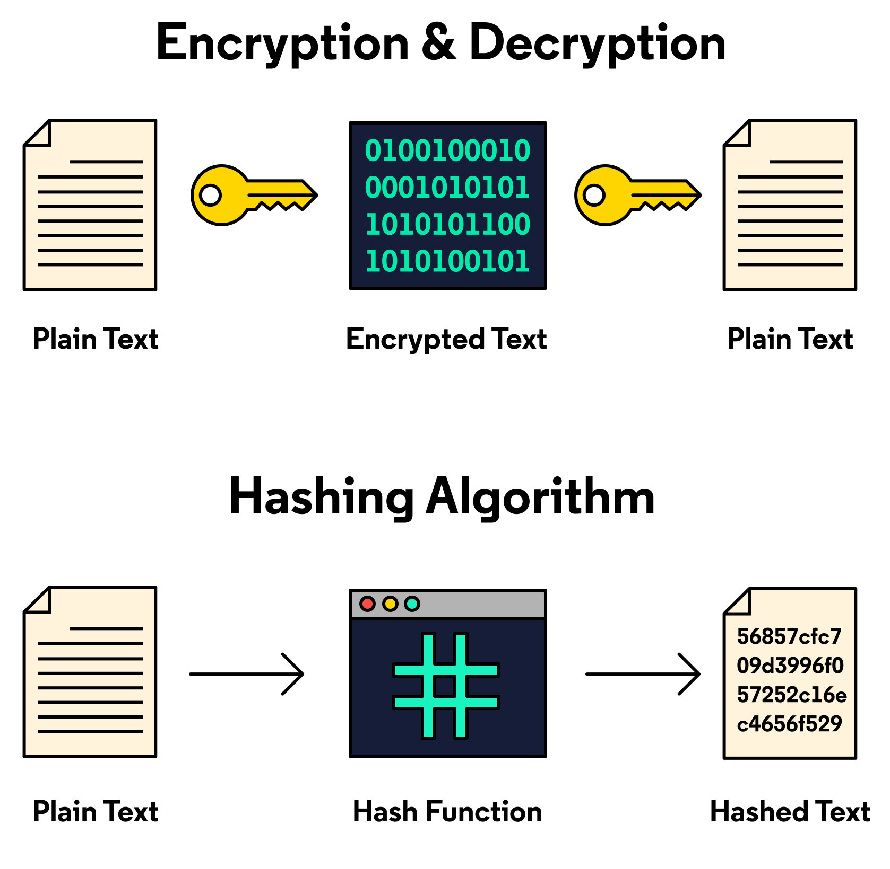

# Confidentiality, Integrity, and Availability
In preparation in becoming a cybersecurity analyst, it is important to understand the fundamental Cybersecurity concepts and terminology. The following list of learning outcomes may be achieved after completing this section:

1. Understand the CIA triad (Confidentiality, Integrity, and Availability)
2. Incorporate the concept into your analyst mindset

 

# The CIA triad
Cybersecurity practitioners are expected to be familiar with funamental security management principles and concepts. An understanding of the CIA Triad is considered a core part of the cybersecurity analyst mindset. The concept simplifies the primary goals and objectives of cybersecurity for both policy writers, system architects, and security practitioners.

The CIA Triad contains the three primary principles in Cybersecurity: **Confidentiality**, **Integrity**, and **Availability**.

 

# Confidentiality

***Definition:*** Preserving safeguards, access controls, and disclosures of sensitive data to ensure pricacy (aka confidentiality) of pensonal and proprietary information from unintended parties.

***Simplified Concept:*** Only authorized individuals, processes, and systems that should have access to information can access it.

The objective of cybersecurity and information security is the achievement of the complete confidentiality of data. For confidentiality to be sucessful, the data and information must be secured from unauthorised disclourse, access, or use, while:

1. **In-Storage:** Information stored in any form of storage must remain secured and confidential. This includes the local hard dis drives (HDD), solid-state disks (SSD), flash drives (USB thumb drives, SD cards, etc)
2. **In-process:** this is any information being actively processed by a processing unity or placed in volatille memory (RAM, Buffers, and Cache memory). This data stored is susceptible to theft from malware or buffer overflow attacks on a computing device, therefore it must be ensured that this data and information remains confidential.

 

To protect information from unauthorised disclosure, access, or theft, access control methodologies are applied to an organisations information security practices. One key concept is the **principle of least privilege**. which restricts resources to the absolutely necessary to perform a job and function. 

**Encryption** is a key technology that contributes to securing data and information from unauthorised access. Encryption techniques such as file/disk encryption and encrypted communications are effective to maintain data and information condifentiality.

 

# Integrity

**Definition:** Guarding data/information, in transit or at rest, from unauthorised destruction or modification or modification so that it remains in the state intended by the owner(s) upon receipt or submission. Ensuring the data/information is authentic and proven to be received from the true origin of the data/information (non-repudiation).

One of the most basic methods for confirming the Integrity of digital assets is cryptogrpahic hashing. In hashing, data is processed through a hash function which produces a unique hash value. The hash value is now similar to a certificate of authenticity. 

Integrity os also vital in ensuring the authenticity of data origins. A concept known as **non-repudiation** is the consolidation of authenticity and integrity to ensure that a user or digital entity is the originator of transmitted communications and data.

# Authenticity

**Definition**: Ensuring that access to information, and the networked services that host the information, are accessible in a reliable and timely manner by users at all times. 

Availability is madatory for networked resources such as databases, web applications, websites, etc. When it comes to networked services, performance, redundancy, backups, and data loss prevention are essential in ensuring availability. 