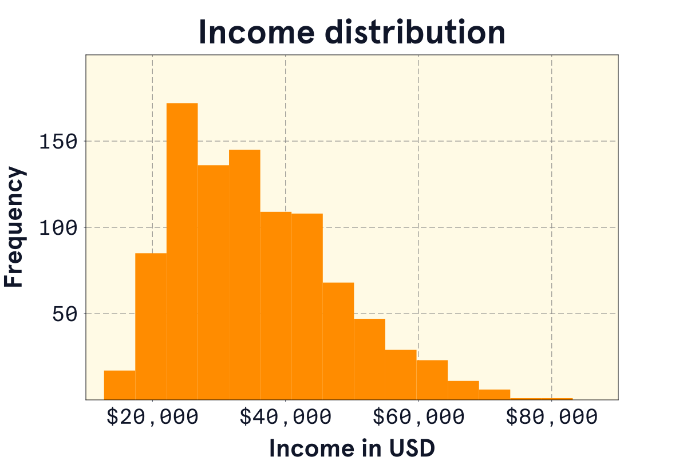
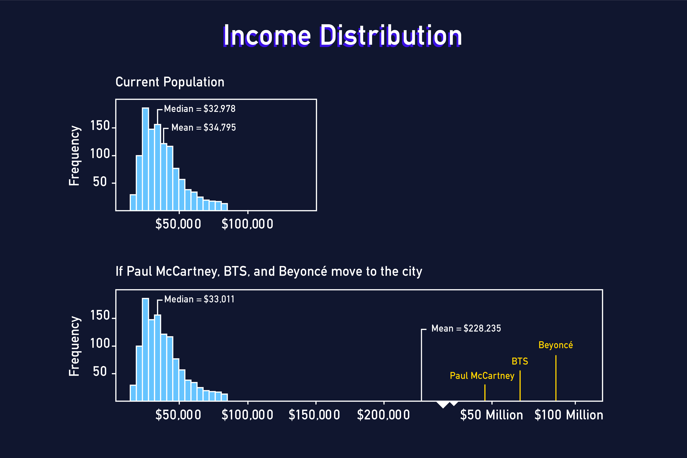
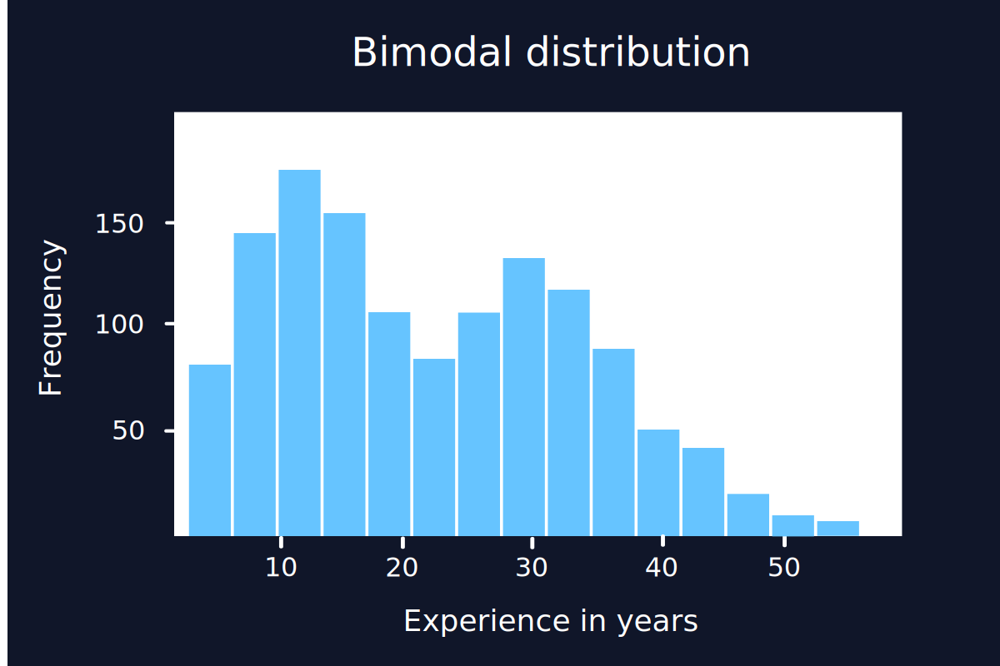
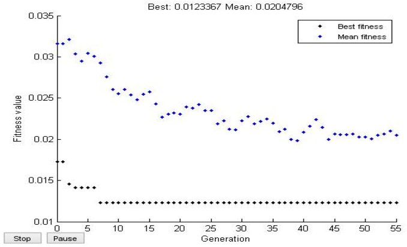

# Statistical Thinking

 

## Mean and Standard Deviation
- the **mean**, also called as the average, describes the centre of a numeric distribution by adding all values and dividing by the count
- the **standard deviation** describes the spread of values in a numeric distribution by measuring the average distance of the values from the mean. 

 

### **Skewed Distributions**
A **skewed** distribution is asymmetrical with a steep change in frequency on one side and a flatter, trailing change in frequency on the other, Specifically, the income distribution is right-skewed (also called positively skewed) because the tail is on the right side.

 

## Median and IQR
The **median** is a method that is used to find the middle value when all values are arranged form the smallest to the largest. 

There is also the **interquartile range (IQR)**. A *quartile* is a simple marker for a quarter or 25% of the data.
- the first quartile marks 25%
- the second quartile marks 50%
- the third quartile marks 75%

The IQR is the difference between Q3 and Q1, marking the range for just the middle of 50% of the data.

 

## Outliers and Robust Measures

Outliers within data can change the metrics we use to evaluate the information. Example as shown below, the outliers by individuals who make so much money. For example, Paul McCartney ($48 Million), BTS ($57 Million), Beyonce ($81 Million).
When factoring in their incomes across an income distribution, we can see that with an without these outliers have an impact on the median.

These incomes are examples of **outliers**, and extreme values that are distant from the rest of the distribution. Just as skewness, outliers tend to more heavily influence the mean than the median.

In this example of the income distribution. As we saw with our understanding of the median and IQR, in this example, we can understand that they are **NOT** heavily influenced by extreme values. Because of this we can say that they are **robust**.

**Robust** statistics are often a better choice to measure the centre and spreadof a  distribution that is skewed or has outliers. 

 

## Aggregate Data
Alongside the mean and media is the **mode**. This **mode** is defined as the value with the highest fequency, but also as the mode as the value where the peak of the distribution occurs. The mode allows us to identify interesting features in a variable.

There may also be more than one mode, such as in a distribution of years of experience.

In the following plot, we can see there's one peak near the 10-year mark and another near the 30-year mark. This would be called as a ***bimodal distribution***-as there are two modes.
Sometimes bimodal distributions occur when there are differences across categories of another variable. 

By separation and then summarising with another function such as the mean. Seeing this and the differences between different groups and the distribution between them. This is called as an **aggregate** of the data. 

 

## Variable Relationships
Aggregatin data is a way of exploring variable relationships. We specifically looked at relationships. We specifically looked at the relationships between a numeric variable and a categorical variable, but we should also examine the relationships between two numeric variables. 

 

In the example graph with the cloud of points we can see that in the plot it contains a pattern. We can dscripbe this relationship more precisely by measuring the **correlation coefficient**. This number ranges from -1 to +1 - it tells us two things about a linear relationship.

1. **Direction:** A positive coeffiecent means that higher values in one variable are associated with higher values in the other. A negative coefficient means higher values in one variable are associated with lower values of the other 
2. **Strength:** The farther the coefficient is from 0, the stronger the relationship and the more the points in a scatter plot look like a line. 