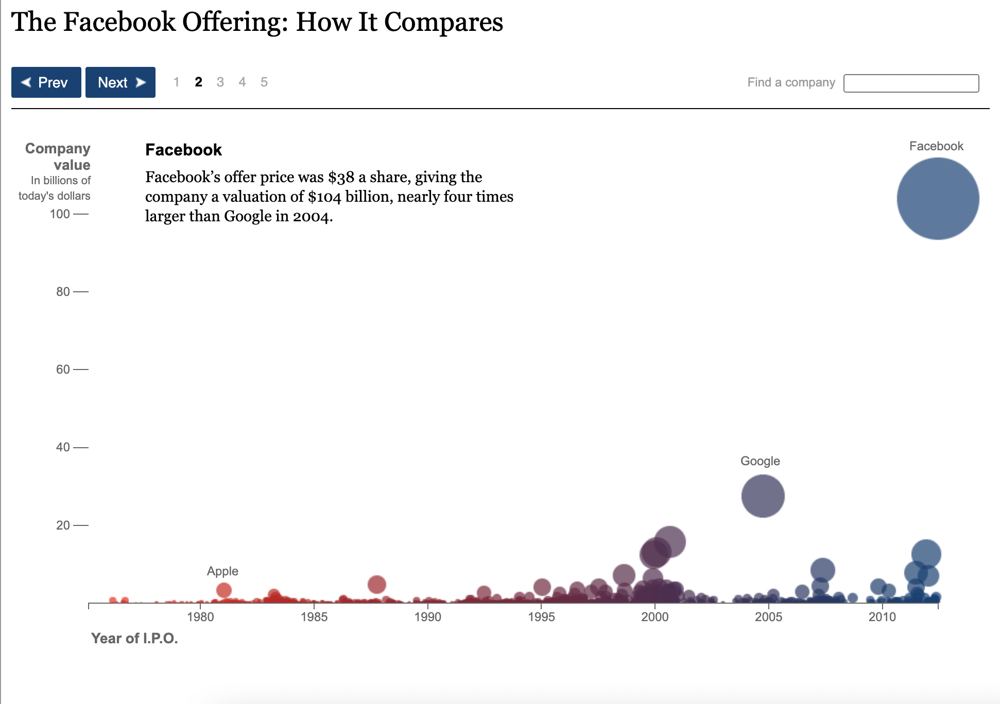

# Data Visiualisation 
Data visualisations are how we can communicate data. We don't read the numbers off a spreadsheet or list every number in a trend to commnuicate a point. We make a visualisation to show them. 
In this module, we'll cover two major ideas:
1. We visualise data to accomplish a goal-to explore and see something new in the data, to strengthen an argument with a visual aid, to share a data-driven idea with someone else, and more.
2. Our design decisions can either help or hinder how effectively a data visual communicates.

 

## From Data Type to Chart Type
The first step of making a data visualisation is choosing a chart type.This is important for communicating about the relationship. 

### **Univariate Charts**
one big consideration when choosing a chart type is how many variables we're comparing. **Univariate** charts help us visualise a change in one variable.Often this means measuring how much, which can either be a **count** or a **distribution**.

A common chart cr counts is the bar graph. If we want to compare an amount between different categories, like how many of each coin is in the bank, or average wingspan of different birds. A bar chart translates the difference in count to a difference in bar height. Remember, the data relationship is translated to a visual relationship.

### **Bi- and Multivariate Charts**
These are any charts that show relationships between two or more variables. An example of a bivariate chart is a scatter plot. One variable on the x-axis, and another on the y-axis, and each point helps us to compare the two variables by its position on the graph. 

 

## Aesthetic Properties
We've covered how we use chart types to highlight a relationship in the data. Now we'll talk about how we use aesthetic properties to further clarify and visualise the details of the data. Aesthetic properties are the attributes we use to communicate data visually: 
- Position
- Size
- Shape 
- Color / pattern

### **Information Redundancy**

In this example of **Information redundancy**. Encoding the same information in different visual properties. We already know that Facebook has the largest company value  becayse it's the highest circle on the chart. Its size gives us another way to visually compare it to the other data points. 

 

Information redundancy is also helpful for prioritising values. There are lots and lots of smaller companies on this graph. ***Information redundancy helps key data points to stand out***.