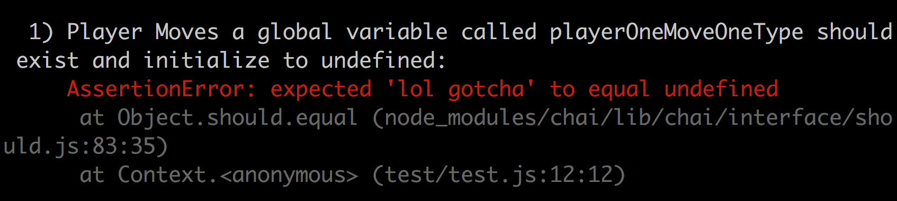
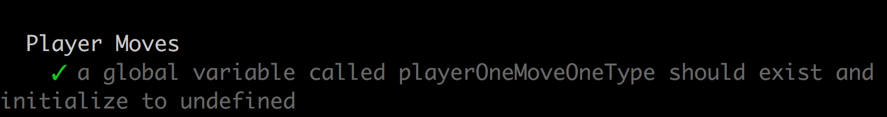

# Running Tests and Interpreting Output with Mocha and Chai

This is a practical guide to reading the output from tests written with Mocha and Chai frameworks.

## Running tests

To run tests for your projects first open the root project directory in your terminal. If you haven't already run `npm install` to stall all necessary testing dependencies. Finally, run `npm test` in your terminal. This command will run the code in your test script in the package json for your project.

## Failing tests

Take it one step at a time! Choose which failing test case you want too work on (often the first failing test case). Look at the error message to identify the line of code for the assertion that failed, and edit your code to pass that spec. Keep re-running the test script every time you think you've made progress, and let the specs guide you to final product.

## A lot of Output

Try appending `.only()` or `.skip()` to your describe or it blocks in order to only run certain tests or skip other certain tests. See the [mocha documentation](https://mochajs.org/#mochaopts) for more details.

## Error Logging

If executing your code causes an error to be thrown, mocha will log that error in the place of an assertion error. Getting from an execution error to an assertion error usually means progress.

### Test Case Fails

This is what the console will display:


Only the first failing assertion should be displayed within. each `it` block. Moving from failing an earlier assertion to failing a later assertion means progress! Here, we see that there is a `Reference Error`. This isn't actually a failing assertion, but instead suggests that the code beinng tested is throwing a error before the assertion is even being run.

A reference error typically indicates that the code is trying to use a variable that has never been declared. Check out the [MDN’s JavaScript docs](https://developer.mozilla.org/en-US/docs/Web/JavaScript/Reference/Global_Objects/Error#Error_types) if you see error types that you are not familiar with.

The end of the log for a failed test case provides a number like 12:18. This indicates that the failed assertion started at line 12, character 18. The line number is the best place to look to identiy the assertion that failed. You should generally ignore the character number, there's usually no reason to count the characters is a line.

So the failing test tells us that we need a global variable called `playerOneMoveOneType`, and it should be initialised as undefined. Let's write some code that will give as an assertion error. Here's some code that will end the reference error that we saww before, by defining the `playerOneMoveOneType` variable, but won't pass the assertion that it should contain the value undefined.

```
// this code exists within the code that we are testing, not the test file
let playerOneMoveOneType = "lol gotcha";
```

When you run the tests again, using `npm test`, you'll get output like this:



Now, chai can give us more information about what we need to. fix, because it got to the assertion before an error was thrown. We can see from the screenshot that an `AssertionError` was raised. The test exxpected 'lol gotcha' to equal undefined. Getting the actual value and the expected value helps us. to pinpoint exactly the changes we need to make to pass this test. 

Now let's fix the code, initialising `playerOneMoveOneType` to undefined as the test instructs.

```
// this code exists within the code that we are testing, not the test file
let playerOneMoveOneType = undefined;
```

Finally, our code passes the test! We can move on to the next test



# Edge Cases

Tests are often written for various edge cases. This is common, because poor handling of edge cases is responsible for a lot of bugs!

An example of common edge case is: how does a function handle weird input? What happens if a function that expects to get a number is passed a strinig, or is passed no argument at all? Do we want to throw an error? Return undefined? Regardless, we want the decision to be consistent and well-documented.

Planning and testing for these edge cases is a common use of tests, and it can make the different between code that will work 80% of the time, and code that will work 100% of the time.
